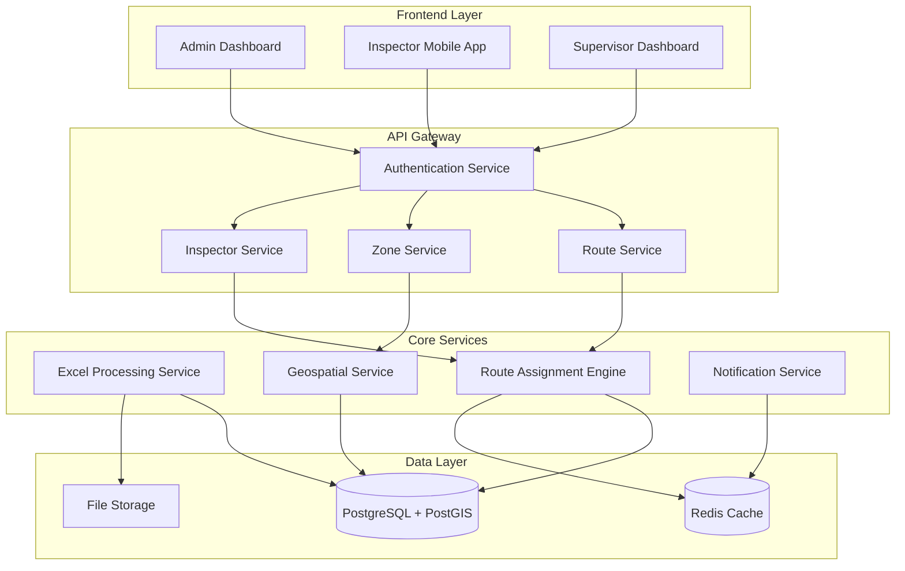

# Design Document

## Overview

The Route Assignment System for ISES is a web-based application that automates the distribution of inspection routes among interventores (inspectors) based on geographic zones and workload balancing. The system processes Excel data containing coordinates and addresses, manages 11 predefined zones (metropolitan and rural), and provides real-time monitoring capabilities.

The system follows a microservices architecture with clear separation between data processing, route optimization, and user interfaces, ensuring scalability and maintainability for ISES operations.

## Architecture

### High-Level Architecture



### Technology Stack

- **Frontend**: React.js with TypeScript, Leaflet for maps
- **Backend**: Node.js with Express.js and TypeScript
- **Database**: PostgreSQL with PostGIS extension for geospatial data
- **Cache**: Redis for session management and real-time data
- **File Processing**: SheetJS for Excel processing
- **Maps**: OpenStreetMap with Leaflet
- **Authentication**: JWT with role-based access control

## Components and Interfaces

### 1. Excel Processing Service

**Purpose**: Handle import and validation of Impuaa.xlsx files containing coordinate and zone data.

**Key Components**:
- `ExcelParser`: Validates and parses Excel files
- `DataValidator`: Ensures data integrity and format compliance
- `ZoneMapper`: Maps addresses to predefined zones

**Interfaces**:
```typescript
interface ExcelImportRequest {
  file: File;
  userId: string;
  importType: 'full' | 'incremental';
}

interface ImportedData {
  coordinates: Coordinate[];
  addresses: Address[];
  zoneAssignments: ZoneAssignment[];
  validationErrors: ValidationError[];
}

interface Coordinate {
  id: string;
  latitude: number;
  longitude: number;
  address: string;
  zone: ZoneType;
}
```

### 2. Zone Management Service

**Purpose**: Manage the 11 predefined geographic zones and their boundaries.

**Key Components**:
- `ZoneRepository`: CRUD operations for zones
- `GeofenceManager`: Handle zone boundary calculations
- `ZoneValidator`: Prevent overlapping zones

**Interfaces**:
```typescript
interface Zone {
  id: string;
  name: string;
  type: 'metropolitana' | 'rural';
  boundaries: GeoPolygon;
  isActive: boolean;
  createdAt: Date;
  updatedAt: Date;
}

interface ZoneType {
  ZONA_I: 'Metropolitana Suroriente';
  ZONA_II: 'Metropolitana Suroccidente';
  ZONA_III: 'Metropolitana Centro Oriente';
  ZONA_IV: 'Metropolitana Centro Occidente';
  ZONA_V: 'Metropolitana Noroccidente';
  ZONA_VI: 'Metropolitana Nororiente';
  ZONA_VII: 'Rural Oriental Norte';
  ZONA_VIII: 'Rural Occidental Norte';
  ZONA_IX: 'Rural Occidental Sur';
  ZONA_X: 'Rural Oriental Sur';
  ZONA_XI: 'Rural Occidental Centro';
}
```

### 3. Inspector Management Service

**Purpose**: Handle inspector registration, availability, and assignment tracking.

**Key Components**:
- `InspectorRepository`: Inspector data management
- `AvailabilityManager`: Track inspector schedules and capacity
- `WorkloadCalculator`: Balance assignments across inspectors

**Interfaces**:
```typescript
interface Inspector {
  id: string;
  name: string;
  identification: string;
  contact: ContactInfo;
  preferredZones: ZoneType[];
  availability: AvailabilitySchedule;
  currentWorkload: number;
  maxDailyRoutes: number;
  isActive: boolean;
}

interface AvailabilitySchedule {
  monday: TimeSlot[];
  tuesday: TimeSlot[];
  wednesday: TimeSlot[];
  thursday: TimeSlot[];
  friday: TimeSlot[];
  saturday: TimeSlot[];
  sunday: TimeSlot[];
}
```

### 4. Route Assignment Engine

**Purpose**: Core algorithm for automatic route distribution and optimization.

**Key Components**:
- `RouteOptimizer`: Calculate optimal routes using traveling salesman algorithms
- `AssignmentAlgorithm`: Distribute routes based on zone, availability, and workload
- `ConflictResolver`: Handle scheduling conflicts and reassignments

**Interfaces**:
```typescript
interface Route {
  id: string;
  name: string;
  points: RoutePoint[];
  estimatedDuration: number;
  priority: 'low' | 'medium' | 'high';
  zone: ZoneType;
  status: 'pending' | 'assigned' | 'in_progress' | 'completed';
  assignedInspector?: string;
  createdAt: Date;
}

interface RoutePoint {
  id: string;
  coordinate: Coordinate;
  estimatedTime: number;
  order: number;
  status: 'pending' | 'completed' | 'skipped';
}

interface AssignmentResult {
  assignments: RouteAssignment[];
  unassignedRoutes: Route[];
  workloadDistribution: WorkloadSummary[];
}
```

### 5. Geospatial Service

**Purpose**: Handle geographic calculations, mapping, and spatial queries.

**Key Components**:
- `DistanceCalculator`: Calculate distances between points
- `ZoneDetector`: Determine which zone contains specific coordinates
- `RouteOptimizer`: Generate optimal paths between multiple points

**Interfaces**:
```typescript
interface GeoPoint {
  latitude: number;
  longitude: number;
}

interface GeoPolygon {
  coordinates: GeoPoint[];
  type: 'Polygon';
}

interface DistanceMatrix {
  from: string;
  to: string;
  distance: number;
  duration: number;
}
```

## Data Models

### Database Schema

```sql
-- Zones table
CREATE TABLE zones (
    id UUID PRIMARY KEY DEFAULT gen_random_uuid(),
    name VARCHAR(100) NOT NULL,
    type VARCHAR(20) NOT NULL CHECK (type IN ('metropolitana', 'rural')),
    boundaries GEOMETRY(POLYGON, 4326) NOT NULL,
    is_active BOOLEAN DEFAULT true,
    created_at TIMESTAMP DEFAULT CURRENT_TIMESTAMP,
    updated_at TIMESTAMP DEFAULT CURRENT_TIMESTAMP
);

-- Inspectors table
CREATE TABLE inspectors (
    id UUID PRIMARY KEY DEFAULT gen_random_uuid(),
    name VARCHAR(100) NOT NULL,
    identification VARCHAR(50) UNIQUE NOT NULL,
    email VARCHAR(100),
    phone VARCHAR(20),
    preferred_zones UUID[] REFERENCES zones(id),
    max_daily_routes INTEGER DEFAULT 5,
    is_active BOOLEAN DEFAULT true,
    created_at TIMESTAMP DEFAULT CURRENT_TIMESTAMP,
    updated_at TIMESTAMP DEFAULT CURRENT_TIMESTAMP
);

-- Coordinates table
CREATE TABLE coordinates (
    id UUID PRIMARY KEY DEFAULT gen_random_uuid(),
    latitude DECIMAL(10, 8) NOT NULL,
    longitude DECIMAL(11, 8) NOT NULL,
    address TEXT,
    zone_id UUID REFERENCES zones(id),
    imported_from VARCHAR(100),
    created_at TIMESTAMP DEFAULT CURRENT_TIMESTAMP
);

-- Routes table
CREATE TABLE routes (
    id UUID PRIMARY KEY DEFAULT gen_random_uuid(),
    name VARCHAR(100) NOT NULL,
    estimated_duration INTEGER, -- in minutes
    priority VARCHAR(10) DEFAULT 'medium',
    zone_id UUID REFERENCES zones(id),
    status VARCHAR(20) DEFAULT 'pending',
    assigned_inspector_id UUID REFERENCES inspectors(id),
    created_at TIMESTAMP DEFAULT CURRENT_TIMESTAMP,
    updated_at TIMESTAMP DEFAULT CURRENT_TIMESTAMP
);

-- Route points table
CREATE TABLE route_points (
    id UUID PRIMARY KEY DEFAULT gen_random_uuid(),
    route_id UUID REFERENCES routes(id) ON DELETE CASCADE,
    coordinate_id UUID REFERENCES coordinates(id),
    point_order INTEGER NOT NULL,
    estimated_time INTEGER, -- in minutes
    status VARCHAR(20) DEFAULT 'pending',
    completed_at TIMESTAMP
);
```

## Error Handling

### Error Categories

1. **Validation Errors**: Invalid data format, missing required fields
2. **Business Logic Errors**: Zone conflicts, capacity exceeded, invalid assignments
3. **System Errors**: Database connection issues, external service failures
4. **User Errors**: Unauthorized access, invalid operations

### Error Response Format

```typescript
interface ErrorResponse {
  error: {
    code: string;
    message: string;
    details?: any;
    timestamp: string;
    requestId: string;
  };
}
```

### Error Handling Strategy

- **Excel Processing**: Detailed validation reports with line-by-line error identification
- **Route Assignment**: Graceful degradation with partial assignments when possible
- **Geospatial Operations**: Fallback to approximate calculations if precise operations fail
- **Real-time Updates**: Queue failed notifications for retry

## Testing Strategy

### Unit Testing
- **Coverage Target**: 90% code coverage
- **Focus Areas**: Business logic, data validation, geospatial calculations
- **Tools**: Jest, Supertest for API testing

### Integration Testing
- **Database Integration**: Test with real PostGIS operations
- **Excel Processing**: Test with various file formats and edge cases
- **Route Optimization**: Validate algorithm performance with different data sets

### End-to-End Testing
- **User Workflows**: Complete flows from Excel import to route completion
- **Cross-browser Testing**: Ensure map functionality works across browsers
- **Mobile Testing**: Validate inspector mobile interface

### Performance Testing
- **Load Testing**: Handle concurrent Excel imports and route assignments
- **Geospatial Performance**: Optimize spatial queries for large datasets
- **Real-time Updates**: Test WebSocket performance under load

### Test Data Strategy
- **Synthetic Data**: Generate test coordinates for all 11 zones
- **Edge Cases**: Test zone boundaries, overlapping areas, invalid coordinates
- **Scale Testing**: Test with realistic data volumes (1000+ coordinates per zone)